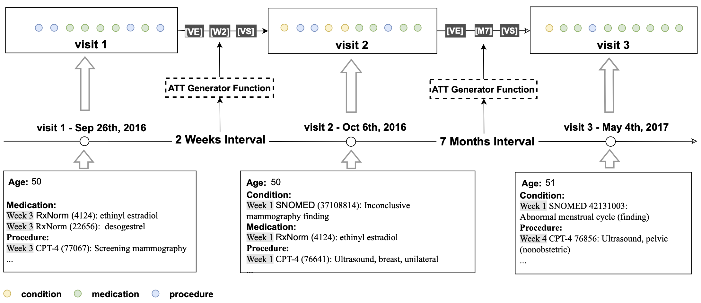
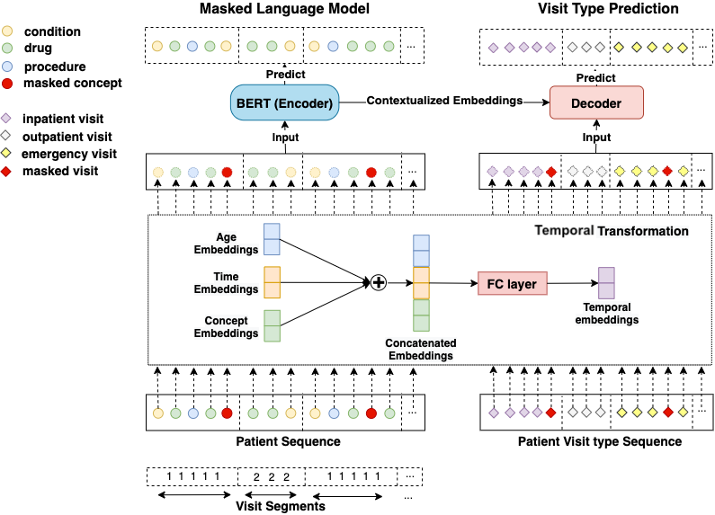

## CEHR-BERT
CEHR-BERT is a large language model developed for the structured EHR data, the work has been published at https://proceedings.mlr.press/v158/pang21a.html. CEHR-BERT currently only supports the structured EHR data in the OMOP format, which is a common data model used to support observational studies and managed  by the Observational Health Data Science and Informatics (OHDSI) open-science community. 
There are three major components in CEHR-BERT, data generation, model pre-training, and model evaluation with fine-tuning, those components work in conjunction to provide an end-to-end model evaluation framework. The CEHR-BERT framework is designed to be extensible, users could write their own [pretraining models](trainers/README.md), [evaluation procedures](evaluations/README.md), and [downstream prediction tasks](evaluations/README.md) by extending the abstract classes, see click on the links for more details. 

### Patient Representation
For each patient, all medical codes were aggregated and constructed into a sequence chronologically.
In order to incorporate temporal information, we inserted an artificial time token (ATT) between two neighboring visits based on their time interval. 
The following logic was used for creating ATTs based on the following time intervals between visits, if less than 28 days, ATTs take on the form of $W_n$ where n represents the week number ranging from 0-3 (e.g. $W_1$); 2) if between 28 days and 365 days, ATTs are in the form of **$M_n$** where n represents the month number ranging from 1-11 e.g $M_{11}$; 3) beyond 365 days then a **LT** (Long Term) token is inserted. In addition, we added two more special tokens — **VS** and **VE** to represent the start and the end of a visit to explicitly define the visit segment, where all the concepts associated with the visit are subsumed by **VS** and **VE**. 



### Model Architecture 
Overview of our BERT architecture on structured EHR data. To distinguish visit boundaries, visit segment embeddings are added to concept embeddings. Next, both visit embeddings and concept embeddings go through a temporal transformation, where concept, age and time embeddings are concatenated together. The concatenated embeddings are then fed into a fully connected layer. This temporal concept embedding becomes the input to BERT. We used the BERT learning objective Masked Language Model as the primary learning objective and introduced an EHR specific secondary learning objective visit type prediction.



## Pretrained model release
We will release the model that we pre-trained soon

## Getting Started


### Pre-requisite
The project is built in python 3.7, and project dependency needs to be installed 

`pip3 install -r requirements.txt`

Create the following folders for the tutorial below
```console
mkdir -p ~/Documents/omop_test/cehr-bert;
```

### 1. Download OMOP tables as parquet files
We have created a spark app to download OMOP tables from Sql Server as parquet files. You need adjust the properties in `db_properties.ini` to match with your database setup.
```console
PYTHONPATH=./: spark-submit tools/download_omop_tables.py -c db_properties.ini -tc person visit_occurrence condition_occurrence procedure_occurrence drug_exposure measurement observation_period concept concept_relationship concept_ancestor -o ~/Documents/omop_test/
```
### 2. Generate training data for CEHR-BERT
We order the patient events in chronological order and put all data points in a sequence. We insert artificial tokens VS (visit start) and VE (visit end) to the start and the end of the visit. In addition, we insert artificial time tokens (ATT) between visits to indicate the time interval between visits. This approach allows us to apply BERT to structured EHR as-is.
The sequence can be seen conceptually as [VS] [V1] [VE] [ATT] [VS] [V2] [VE], where [V1] and [V2] represent a list of concepts associated with those visits.

```console
PYTHONPATH=./: spark-submit spark_apps/generate_training_data.py -i ~/Documents/omop_test/ -o ~/Documents/omop_test/cehr-bert -tc condition_occurrence procedure_occurrence drug_exposure -d 1985-01-01 --is_new_patient_representation -iv 
```

### 3. Pre-train CEHR-BERT
If you don't have your own OMOP instance, we have provided a sample of patient sequence data generated using Synthea at `sample/patient_sequence` in the repo. CEHR-BERT expects the data folder to be named as `patient_sequence`
```console
PYTHONPATH=./: python3 trainers/train_bert_only.py -i sample_data/ -o ~/Documents/omop_test/cehr-bert -iv -m 512 -e 1 -b 32 -d 5 
```
### 4. Generate hf readmission prediction task
If you don't have your own OMOP instance, we have provided a sample of patient sequence data generated using Synthea at `sample/hf_readmissioon` in the repo
```console
PYTHONPATH=./:$PYTHONPATH spark-submit spark_apps/prediction_cohorts/hf_readmission.py -c hf_readmission -i ~/Documents/omop_test/ -o ~/Documents/omop_test/cehr-bert -dl 1985-01-01 -du 2020-12-31 -l 18 -u 100 -ow 360 -ps 0 -pw 30 --is_new_patient_representation
```

### 5. Fine-tune CEHR-BERT for hf readmission
```console
# Copy the pretrained bert model
mv sample_data/hf_readmission ~/Documents/omop_test/cehr-bert/hf_readmission;

# Create the evaluation folder
mkdir -p ~/Documents/omop_test/evaluation_train_val_split/hf_readmission/;

# In our experiment, we use the model snapshot generated from the second epoch
cp ~/Documents/omop_test/cehr-bert/bert_model_02_* ~/Documents/omop_test/cehr-bert/bert_model.h5;
PYTHONPATH=./: python3 evaluations/evaluation.py -a sequence_model -sd sample_data/hf_readmission -ef ~/Documents/omop_test/evaluation_train_val_split/hf_readmission/ -m 512 -b 32 -p 10 -vb ~/Documents/omop_test/cehr-bert -me vanilla_bert_lstm --sequence_model_name CEHR_BERT_512 --num_of_folds 4;
```

## Contact us
If you have any questions, feel free to contact us at CEHR-BERT@lists.cumc.columbia.edu

## Citation
Please acknowledge the following work in papers

Chao Pang, Xinzhuo Jiang, Krishna S. Kalluri, Matthew Spotnitz, RuiJun Chen, Adler
Perotte, and Karthik Natarajan. "Cehr-bert: Incorporating temporal information from
structured ehr data to improve prediction tasks." In Proceedings of Machine Learning for
Health, volume 158 of Proceedings of Machine Learning Research, pages 239–260. PMLR,
04 Dec 2021.
