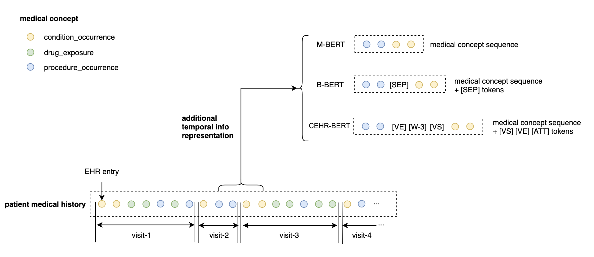
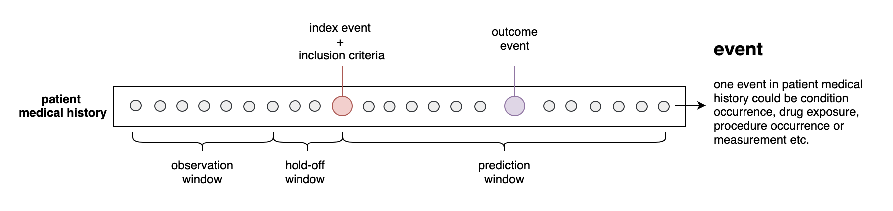

# Data Generation
There are two types of data generations supported by our repo, 1) pretraining data; 2) prediction tasks for fine-tuning. 

## Data For Pretraining
We provided a spark application that could generate three types of patient representations used by CEHR-BERT, MedBert, and BEHRT, the differences could be demonstrated in the below,


### CEHR-BERT Representation
CEHR-BERT inserts artificial time tokens (ATT) between visits as well as two special tokens (VS) and (VE) to indicate the start and the end of a visit. This representation is used when `is_new_patient_representation` is present in the command.

```console
# assuming you are in the root directory
# if the command does not work, try removing the two dashes
PYTHONPATH=./: spark-submit spark_apps/generate_training_data.py -i ~/Documents/omop_test/ -o ~/Documents/omop_test/cehr-bert -tc condition_occurrence procedure_occurrence drug_exposure -d 1985-01-01 --is_new_patient_representation -iv 
```

### MedBert Representation
MedBert does not insert any special tokens between visits. When neither `is_new_patient_representation` nor  `is_classic_bert_sequence` is present, the MedBert representation is used. 
```console
# assuming you are in the root directory
# if the command does not work, try removing the two dashes
PYTHONPATH=./: spark-submit spark_apps/generate_training_data.py -i ~/Documents/omop_test/ -o ~/Documents/omop_test/medbert -tc condition_occurrence procedure_occurrence drug_exposure -d 1985-01-01
```

### BEHRT Representation
BEHRT inserts a **SEP** token between visits. This representation is enabled when `is_classic_bert_sequence` is present.
```console
# assuming you are in the root directory
# if the command does not work, try removing the two dashes
PYTHONPATH=./: spark-submit spark_apps/generate_training_data.py -i ~/Documents/omop_test/ -o ~/Documents/omop_test/behrt -tc condition_occurrence procedure_occurrence drug_exposure -d 1985-01-01 --is_classic_bert_sequence
```


## Prediction Tasks
Here is a list of prediction tasks that have been created for evaluating CEHR-BERT, which can be found in the [prediction_cohorts](prediction_cohorts) folder. 
|Prediction Tasks|Index event|Inclusion criteria|Outcome event|Observation window|Hold-off window|Prediction window|
|-----------|-----------|---------------------|-------------|------------------|---------------|-----------------|
|t2dm hf|Type 2 Diabetes Mellitus condition occurrence or medication exposure|No pre-existing diabetes, type 1 diabetes, diabetes insipidus, gestational diabetes, secondary diabetes, neonatal diabetes|Heart Failure|unbounded|0|unbounded|
hf readmit|Heart Failure condition occurrence|At least one HF treatment, lab test or medication exposure | Readmission | 360 days | 0 | 30 days|
|discharge home death | Discharge to home | Following an in-patient visit | Death | 360 days | 0 | 360 days|
|hospitalization | EHR start | Number of visits between 2 and 30 | In-patient visit | 540 days | 180 days | 720 days|


### T2DM HF
Here is an example of how to generate the t2dm hf task.
* -ps: prediction window start on day 30 after the index date 
* --is_first_time_outcome: the first time outcome
* --is_prediction_window_unbounded: the prediction window is unbounded so long as the outcome occurs after index_date + 30 days, then it’s flagged as a positive case
* --is_observation_window_unbounded: the observation window is unbounded and it’s defined as any time prior to the index date
* -dl 1985-01-01 indate the date lower bound
* -du 2020-12-31 indicate the date upper bound
* -l 18 age lower bound
* -u 100 age upper bound
* --is_new_patient_representation: cehr-bert patient representation 
```console
PYTHONPATH=./:$PYTHONPATH spark-submit spark_apps/prediction_cohorts/t2dm_hf_cohort.py -- -c t2dm_hf  -i ~/Documents/omop_test/ -o ~/Documents/omop_test/cehr-bert -dl 1985-01-01 -du 2020-12-31 -l 18 -u 100 -ow 0 -ps 30 --is_new_patient_representation --is_first_time_outcome --is_prediction_window_unbounded --is_observation_window_unbounded
```

### HF Readmission
Here is an example of how to generate the hf readmission task.
* -ps: prediction window start on day 0 after the index date
* -pw: prediction window 30 days
* -dl 1985-01-01 indate the date lower bound
* -du 2020-12-31 indicate the date upper bound
* -l 18 age lower bound
* -u 100 age upper bound
* --is_new_patient_representation: cehr-bert patient representation 
```console
PYTHONPATH=./:$PYTHONPATH spark-submit spark_apps/prediction_cohorts/hf_readmission.py -c hf_readmission -i ~/Documents/omop_test/ -o ~/Documents/omop_test/cehr-bert -dl 1985-01-01 -du 2020-12-31 -l 18 -u 100 -ow 360 -ps 0 -pw 30 --is_new_patient_representation
```


## Prediction Task Construction
We construct the prediction tasks using the OHDSI patient-level prediction framework. A prediction task can be phrased as the following, ***among a particular group of people, who will go on and experience some event***. One can think of this problem as defining a target cohort that represents the initial group of people, and an outcome cohort that represents the subset of the initial group who will experience a particular event. 



Both target and outcome cohorts can be defined as a group of people who satisfy certain inclusion criteria for a certain period. Typically, a cohort definition includes a cohort entry event and a set of inclusion criteria. The cohort entry event marks the index date, at which the patients enter the cohort, and the inclusion criteria add more constraints to the cohort if applicable, such as the requirements of certain diagnoses, medications, procedures, or temporal relationships. 

We extract features from the observation window and exclude all the features from the hold-off window (if specified). In addition, a prediction window needs to be provided for generating the ground truth labels, if the outcome index date falls between the index date of the target cohort and the prediction window, we will declare the case to be positive, and otherwise negative.